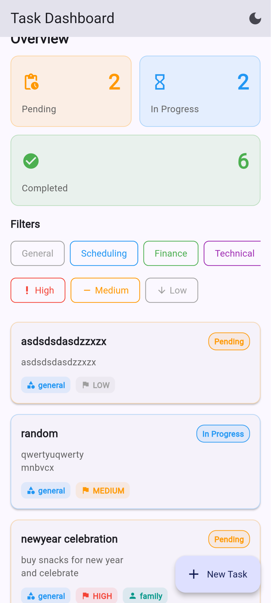
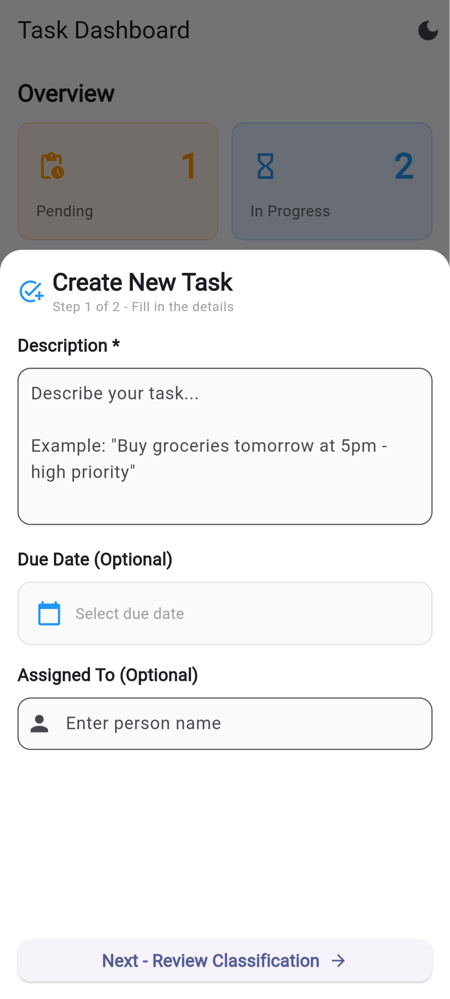
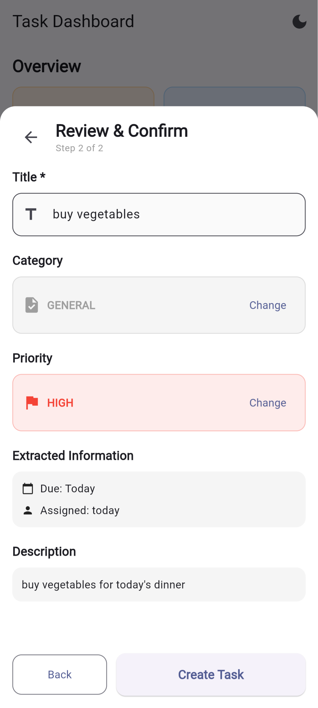
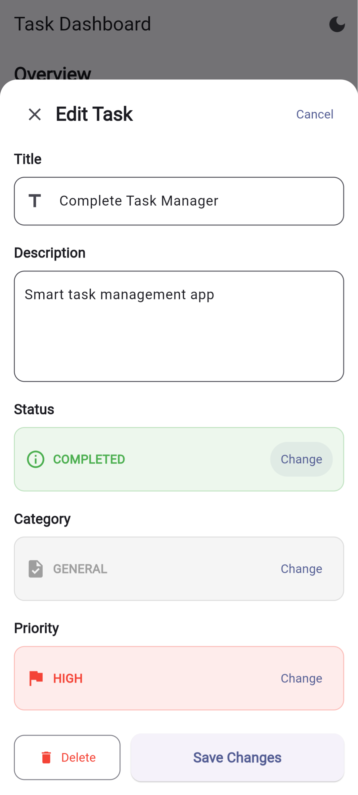
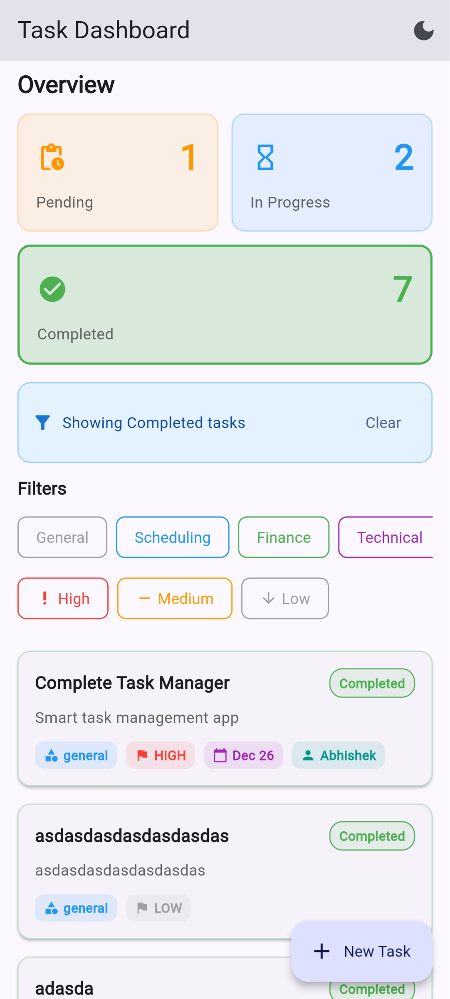
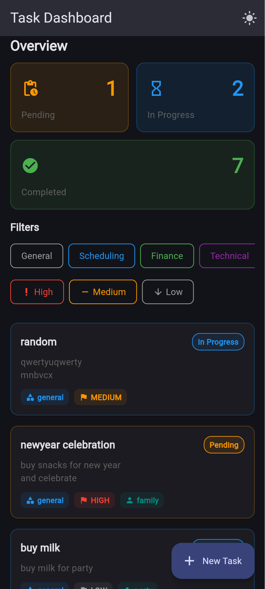
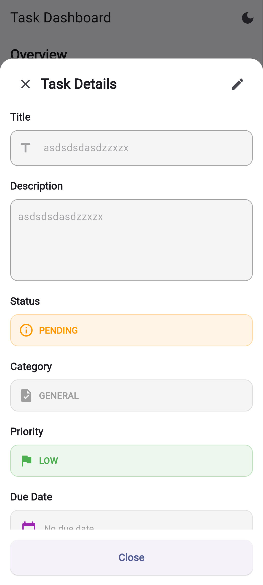
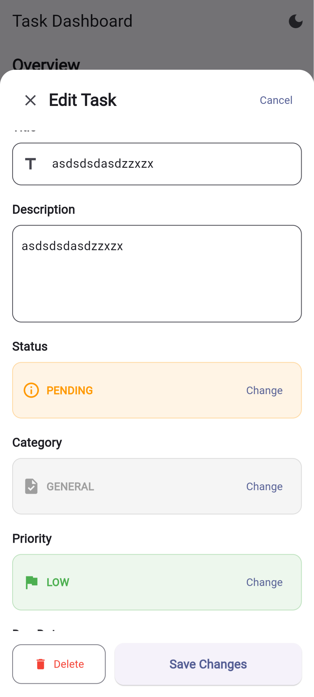
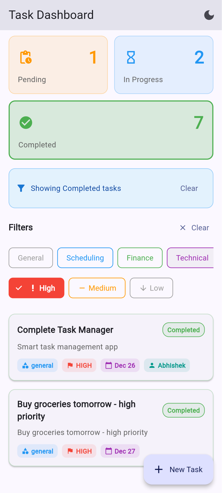

# 🎯 Intelligent Task Manager

> Smart task management system with automatic classification logic, just say what you want to do; it will do the rest.

## 📸 Screenshots

<p align="center">
  
  
  
</p>

<p align="center">
  
  
  
</p>

<p align="center">
  
  
  
</p>

## 📱 Overview

**Backend**: RESTful API with intelligent classification | **Mobile**: Flutter cross-platform app

### Key Features

- ✨ **Intelligent Classification** - Auto-categorizes tasks (scheduling, finance, technical, safety)
- 🎯 **Priority Detection** - Identifies urgency from keywords (urgent, asap, critical)
- 📅 **Entity Extraction** - Extracts dates, people, locations, and action verbs
- 📊 **History Tracking** - Complete audit trail of all changes
- ✅ **Input Validation** - Joi-based validation with detailed errors
- 🔍 **Advanced Filtering** - Category, status, priority filters with pagination
- 📱 **Cross-Platform** - iOS, Android, and Web from single codebase

## 🛠 Tech Stack

**Backend**: Node.js • TypeScript • Express • PostgreSQL • Joi • Jest  
**Mobile**: Flutter • Dart • Provider • Material Design 3

## 🚀 Quick Start

### Backend
```bash
cd backend
pnpm install
# Create .env with DATABASE_URL
pnpm dev  # http://localhost:3000
```

### Mobile
```bash
cd mobile/task_manager
flutter pub get
flutter run
```

## 📚 Documentation

- **[Backend API](./backend/README.md)** - Complete API docs, database schema, architecture
- **[Mobile App](./mobile/task_manager/README.md)** - Flutter setup and features
- **[API Reference](./backend/API_QUICK_REFERENCE.md)** - Quick endpoint reference
- **[Testing](./backend/TESTING.md)** - Test coverage and examples

## 📊 API Endpoints

```
POST   /api/task/preview        # Preview classification
POST   /api/task                # Create task
GET    /api/task                # List tasks (filters: category, status, priority)
GET    /api/task/:id            # Get task details
PUT    /api/task/:id            # Update task
DELETE /api/task/:id            # Delete task
GET    /api/task/:id/history    # Task history
GET    /api/history/recent      # Recent changes
```

## 🧪 Testing

```bash
cd backend
npm test              # Run 16 classification tests
npm run test:coverage # Coverage report
```

## 🏗 Project Structure

```
.
├── backend/              # Node.js + TypeScript API
│   ├── src/
│   │   ├── config/      # Database configuration
│   │   ├── middleware/  # Validation middleware
│   │   ├── modules/     # Tasks & history modules
│   │   └── utils/       # Classification logic
│   └── README.md
└── mobile/
    └── task_manager/    # Flutter app
        ├── lib/features/
        └── README.md
```
